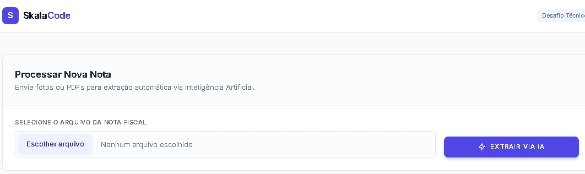

# Extrator de Notas Fiscais com IA
Esta é uma aplicação Laravel desenvolvida para o desafio técnico da Skala. O objetivo é facilitar a gestão de gastos através do upload de Notas Fiscais (PDF ou Imagem), onde uma Inteligência Artificial (Gemini 2.5 Flash) extrai automaticamente os dados relevantes.



## 🛠️ Tecnologias Utilizadas
Framework: Laravel 11

Estilização: Tailwind CSS

IA: Google Gemini API (Modelo 2.5 Flash)

Banco de Dados: SQLite (pela praticidade no teste)

## 📋 Pré-requisitos
Antes de começar, você vai precisar ter instalado:

PHP 8.3 ou superior
Composer
Uma chave de API do [Google AI Studio](https://aistudio.google.com/)

## 🔧 Instalação e Configuração
Siga os passos abaixo para rodar o projeto localmente:

**Clone o repositório:**

```Bash
git clone https://github.com/michael-mallmann/leitor-notas-fiscais.git
cd leitor-notas-fiscais
```

**Instale as dependências:**

```bash
composer install
```

```bash
npm install && npm run build
```

**Configure as variáveis de ambiente:**
Copie o arquivo de exemplo e configure sua chave da API:

```Bash
cp .env.example .env
```
**Abra o arquivo .env e preencha a sua chave:**
GEMINI_API_KEY=sua_chave_aqui

**Prepare o Banco de Dados e a Chave do App:**

```Bash
php artisan key:generate
touch database/database.sqlite
php artisan migrate
```


**Crie o link simbólico para o Storage:**
(Essencial para que as imagens das notas apareçam no histórico)

```Bash
php artisan storage:link
```

**Inicie o servidor:**
1
```Bash
php artisan serve
```
Acesse: http://localhost:8000

## 🧠 Como funciona a extração?
O sistema utiliza um prompt estruturado enviado ao modelo Gemini 2.5 Flash. A IA analisa o arquivo enviado e retorna um JSON com:

Nome da Empresa
CNPJ
Lista de Produtos/Itens
Data da Emissão
Valor Total
Categoria Sugerida

## 🚀 Próximos Passos (Roadmap)
- [ ] **Sistema de Autenticação:** Implementar Laravel Breeze para que cada usuário tenha seu próprio histórico privado de notas.
- [ ] **Multi-empresa:** Suporte para gestão de diferentes CNPJs em uma única conta.

## ✒️ Autor
# Michael Mallmann - https://github.com/michael-mallmann/

